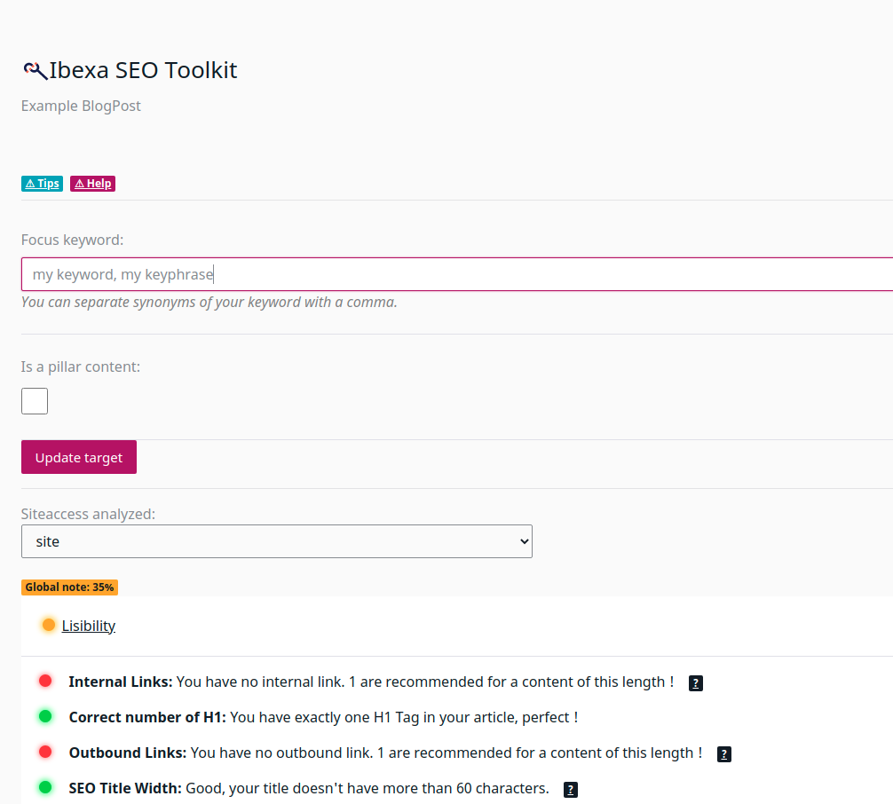

______________

  <strong>Toolkit as a Symfony bundle to enhance Ibexa SEO capabilities.</strong>

    
    
    
    

## Features

- :electric_plug: Super easy to start by using the full-featured controllers and services :point_right:

- :octopus: Extendable analysis of SEO content

- :telescope: Blazing fast analysis when editing content

- :mag_right: Configure content for SEO performance

- :space_invader: Exploit Ibexa freedom of use to make power SEO tooling for your client

- :clapper: Overriding controller methods with ease

- :wrench: Tiny config

- :gift: Additional helper services

- :pencil2: Complete documentation

More details available on [features][2].

Installation
-----------

* [Installation procedure](docs/INSTALL.md)

Documentation
-------------

* Read the [Getting Started guide][5] if you are new to the bundle
* Additionally, read the [Analyzers][6] documentation.

Contributing 
------------

This bundle allows you to make your own custom content analyses. You can contribute your packaged analyses to the community, or [contributing directly to this bundle][7]. 

[1]: https://www.codein.fr
[2]: docs/FEATURES.md
[3]: docs/INSTALL.md
[4]: docs/REQUIREMENTS.md
[5]: docs/GETTING_STARTED.md
[6]: docs/ANALYZERS.md
[7]: CONTRIBUTING.md
