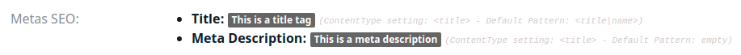
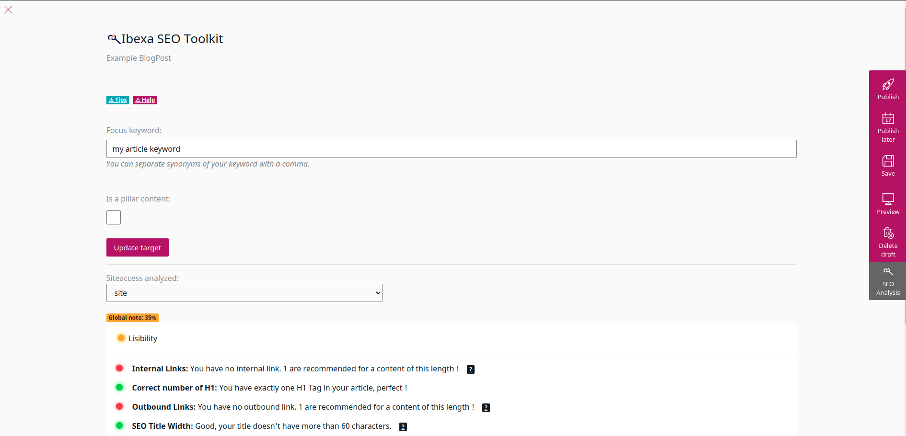
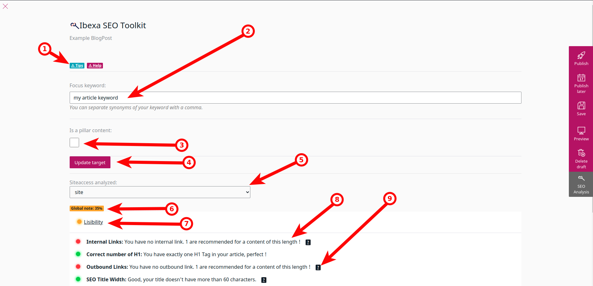

# User Documentation

This documentation is for Ibexa Contibutors

## Disclaimer

These tools should not replace a global SEO strategy.

Our goal is to support you in the structuration and the respect of the best practices in your content creation.
 
## Features

### Metas 

Metas you can play with are configured by your developper.

When you are viewing a content on the backoffice, if your content has an SEO Metas field type, you can see it like this.

Developers can set for you a generic pattern like "content name - custom field".

In case you want a custom title, you can do it by editing your content.

### SEO Analysis for Content

Codein eZPlatform SEO Toolkit provides in depth SEO analysis of your content.

No Artificial Intelligence, but we use some commonly followed best practices to guide our analysis.

Any developer can create his own analysis type if you require something specific.

You can display the SEO Analysis for your current content by editing it.

Then click on the button "SEO Analysis" on the sidebar:

#### SEO Analysis View

Here's your SEO Analysis.

At first, you'll have to configure some parameters to make everything work, like your focus keyword, or if your content is Pillar to your SEO Strategy or not. 

Detailed Explanation of the view
1) Some tips and help (clickable) which explain some important things

2) **Focus keyword**: which keyword you want to rank for ?

3) **Is Pillar Content**: A pillar content is an important content for your SEO strategy. It's generally an exhaustive content that covers a topic in your niche.

4) **Update target**: Save your Keyword and pillar content changes (it refreshes your analysis automatically)

5) **Siteaccess analyzed**: Your website can have multiple versions of it (by language, or by brand for example). The siteaccess selected will provide you a way to check the site you want to analyze.

6) **Global Note**: The general note your content gets. Average between all analyses.

7) **Category**: By default, your analyses are categorized in two groups: Lisibility ou Keyword. Developers can create their own Category.

8) **Type of Analysis**: You get several analysis case. They provide you good intel to help you rank your content higher.

9) **Help button**: This button provides additional information for the type of analysis concerned