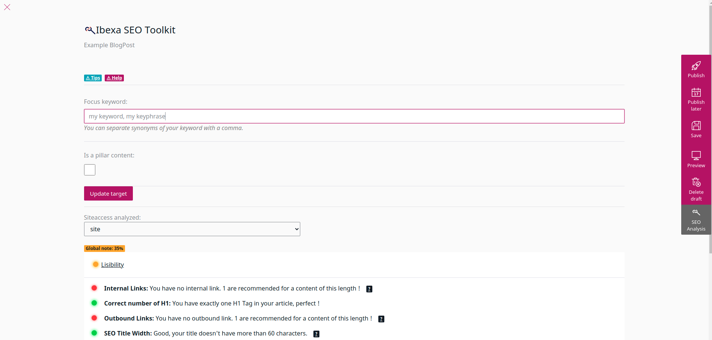

# Analyzers
An analyzer is a service that analyze a content or one of its fields and calculate a score.
This score is calculated according to criteria specific to the analyzer.

Analyzers allows the editor to provide good intel of whether the writing strategy is adapted to the focus keyword we want to rank on (a.k.a. _Keyword analysis_).

It also helps content creators to write content which will be read well by both search engines and the customer (a.k.a. _Lisibility analysis_).

_For more details, you can check the [analyzers guide](../ANALYZERS.md)._

## Configuration

To enable analyzers on a content type, update the configuration of the bundle:

```yml
# config/packages/codein_ibexa_seo_toolkit.yaml

codein_ibexa_seo_toolkit:
  system:
    default: # siteaccess
    internal_links_hostnames: # To improve links analysis, set hostnames to consider as internal absolute links
        - myhostname.com
      analysis:
        content_types:
          product:
            richtext_fields:
              - description
            blocklist:
              - "Codein\\IbexaSeoToolkit\\Analysis\\Analyzers\\WordCountAnalyzer"
        siteaccesses_blocklist: ['admin', 'admin_group']
        blocklist: ["Namespace\\SomeAnalyzerYouNeverWantToUse"]
```

This configuration allows the product content type to be analyzed.

On the `product` content type, the field identified by `description` will be analyzed.

`siteaccesses_blocklist`: Some siteaccesses can't be analyzed, admin for example. Block them here from being analyzed.

`blocklist`: You can prevent some analyzers to run, if you don't find them useful.

## Result


