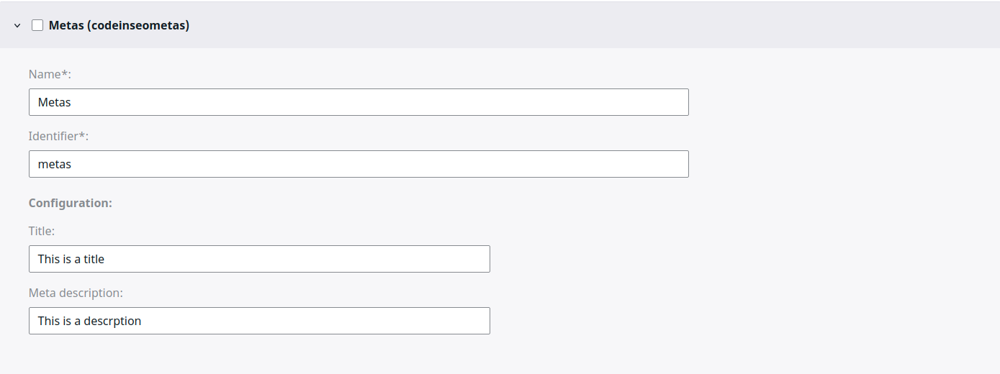
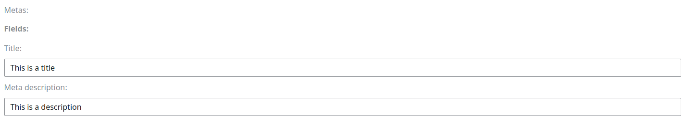

# Metas

Meta informations help search engines understand the pages topic, it is still necessary and very useful for SEO today.

The bundle allows to add a `codeinseometas` field type to a content type to store theses informations.

## Configuration

```yml
# config/packages/codein_ibexa_seo_toolkit.yaml

codein_ibexa_seo_toolkit:
  system:
    default:
      metas:
        default_metas:
          copyright: 'My Company'
          author: 'John Doe'
        field_type_metas:
          title:
            label: 'Title'
            default_pattern: "<title|name>"
          description:
            label: 'Description'
            type: ezstring
          robots_index:
            label: 'Robots (index)'
            type: ezboolean
          robots_follow:
            label: 'Robots (follow)'
            type: ezboolean
          og:image:
            type: ezimage
            default_pattern: <thumbnail|image>
```

`default_metas`: Add meta information which have the same and unique value for each content type.

`field_type_metas`: Add meta information which have a value defined by another field of the content type.

This configuration adds meta informations `copyright` and `author` with respective values `My Company` and `John Doe` for any content type with `codeinseometas` attribute.
It also adds :
* `title` : _with by default the value of the `title` field of the content type (or the `name` field if it doesn't exist)_
* `description`
* `robots_index` : _boolean value (checkbox) to indicate if the page can be indexed or not_
* `image` : _with the value of the `thumbnail` field of the content type (or the `image` field if it doesn't exist)_

There are 3 levels of fallback which allow to set a value for the metas :
* 1: in configuration (`codein_ibexa_seo_toolkit.yaml`)


* 2: in the Field Type definition (Administration Interface, on the Content Type)



* 3: in the Content (Administration Interface, on the Content)



## Result

The meta informations can be rendered as any other content field in a twig template:
```twig
<head>
    {{ ez_render_field(content, 'metas') }}
    ...
</head>
```

The result can be seen in the source code of the page:
```html
<head>
    <meta name="copyright" content="My Company"/>
    <meta name="author" content="John Doe"/>
    <title> This is a title </title>
    <meta name="description" content="This is a description">
    <meta property="robots" content="index, nofollow"/>
    <meta property="og:image" content="my_image.jpg"/>
    <meta property="og:image:width" content="1200"/>
    <meta property="og:image:height" content="630"/>
    ...
</head>
```

If you want to render a page that's not an Ibexa Content (for example a classic Symfony route), you can still render the default meta informations by including this template :
```twig
<head>
    {# You can override the default metas according if you need it #}
    
    ...
</head>
```

## Meta field type

### ezstring

`ezstring` is the meta field default type, it adds a simple text input in the meta fields form.

_Result in the source code of the page :_
```html
<meta name="description" content="This is a description"/>
```

### ezboolean

`ezboolean` adds a checkbox in the meta fields form.

_Result in the source code of the page :_
```html
<meta name="my_boolean" content="0"/>
```

### ezimage

`ezimage` doesn't add input in the meta fields form, it can only take value of fields passed in the `default_pattern` option.

_Result in the source code of the page :_
```html
<meta property="my_image" content="my_image.png"/>
<meta property="my_image:width" content="1200"/>
<meta property="my_image:height" content="630"/>
```

### title

There is a particular case if a meta field has the name 'title', a `title` tag is displayed instead of a `meta` tag :
```html
<title> This is a title </title>
```

### robots
There is another particular case for meta fields starting with 'robots_', they are all grouped in the same `meta` tag :
```yaml
field_type_metas:
  robots_index:
    label: 'Robots (index)'
    type: ezboolean
  robots_follow:
    label: 'Robots (follow)'
    type: ezboolean
  robots_archive:
    label: 'Robots (archive)'
    type: ezboolean
```
```html
<meta property="robots" content="index, nofollow, archive"/>
```
