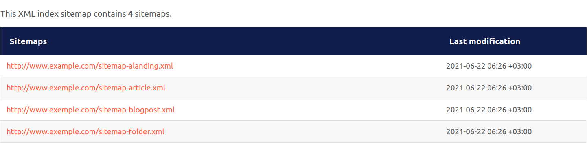

# Sitemap

A sitemap is a representation of the website's architecture in hierarchical form.

The bundle allows to generate the sitemap and split it in multiple sitemap files, either by number of results, or by content type.

## Configuration

```yml
#config/packages/codein_ibexa_seo_toolkit.yaml

codein_ibexa_seo_toolkit:
  system:
    default:
      sitemap:
        split_by: "content_type" # One of "number_of_results"; "content_type"
        use_images: true #or false
        max_items_per_page: 1000 # defaults 500, applies to number_of_results split
        blocklist:
          locations:             [2, 5]
          subtrees:             [153]
          content_type_identifiers: ['product']
        passlist:
          locations:             []
          subtrees:             []
          content_type_identifiers: []
```
`split_by`: in case of a to large sitemap, it gives an option to split either by number of results or content_types.

`blocklist`: disallow some objects to appear in sitemap

`passlist`: allow only some objects to appear in sitemap

## Result


